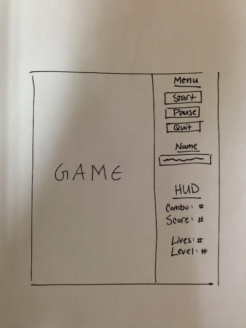

# Game Design Document

## Overview
The premise for City Defense is simple: you, controlling your ship, are responsible for defending your city from an alien invasion. Your city is positioned at the bottom of the screen, with your ship located immediately above it. Your ship may only move horizontally and shoot upwards at the enemy aliens. If any of the three types of aliens (detailed below) get past your ship and begin ravaging your city, you lose one of your three lives. **However, the ship itself is invulnerable to alien attacks, allowing for clutch last second defenses.** Points are awarded for successfully shooting aliens and a bonus blimp; even more points are awarded for consecutive hits (combos). The game continues indefinitely, slowly increasing its speed over time. When you lose all of your lives... game over!

## 'Things'
  1. City
    * Nonmoving.
    * Function: The city, located (and spanning) the bottom of the screen, is what the player is defending. If any enemy gets past the player's ship and the city takes damage, then the player will lose a life.
    * Visual: The city will look like a metropolitan city (high rise buildings and such), and will be very easily identifiable. It will span the bottom of the playing field.
  1. Bullet
  	* Moving.
  	* Function: The bullet is created whenever the player presses the space bar. One bullet is created per space bar press. This is the means by which the player destroys aliens and defends the city.
  	* Visual: The bullet will very obviously look like a bullet, and will travel upwards at a high velocity.
  1. Fast Enemy
    * Moving.
    * Function: The fast enemy will start at the top of the screen and quickly make its way down to the city, in a straight line. In order to defeat this enemy, the player must react quickly before he reaches the city. The fast enemy is fragile; he dies in one shot.
    * Visual: The fast enemy will look like a small and dextrious alien/bug. The enemy will look the part (in that it will be very obvious that he can move fast and die easily).
  1. Slow Enemy
    * Moving.
    * Function: The slow enemy will start at the top of the screen and slowly make its way down to the city in a straight line. The slow enemy dies in 3 shots. In order to defeat this enemy, the player must spend valuable time to shoot him multiple times in order to kill him before he reaches the city.
    * Visual: The slow enemy will look like a fat and hunkering alien/bug. The enemy will look the part (in that it will be very obvious that he moves slow and requires multiple shots to kill).
  1. Bouncing Enemy
    * Moving.
    * Function: The bouncing enemy will start at the top of the screen and make its way down to the city at a moderate speed while bouncing from side to side off of the edges of the screen. In order to defeat this enemy, the player must correctly time his shots to collide with the enemy at the right moment. The bouncing enemy dies in 1 shot.
    * Visual: The bouncing enemy will look like a moderately sized alien/bug with tentacles that indicate its ability to bounce. The enemy will look the part (in that it will be very obvious that he moves in a bouncing pattern and requires one shot to kill).
  1. Blimp
    * Moving.
    * Function: The blimp offers the player a chance to score bonus points. The blimp simply flies across the top of the screen at random times, and if the player shoots the blimp, he will score a large amount of bonus points. If the player does not shoot the blimp, however, no penalty will be inflicted. It is destroyed when it hits the other side of the screen.
    * Visual: The blimp will look like a cartoony blimp. It will look its part (in that it's obvious that the blimp offers extra points, but does not damage the player if it's missed).
  1. Following Enemy
    * Moving.
    * Function: The following enemy tracks the player's location and constantly moves toward his/her ship; it moves at a constant y-velocity, and gradually toward the ship in the x-direction. It is worth the same amount of points as the bouncing enemy, and dies in 1 shot.
    * Visual: The following enemy looks like the bouncing enemy, except it is purple.
  1. AI Enemy Bullet
    * Moving.
    * Function: The enemy bullet shoots at the player at set intervals throughout the game from every following enemy that is on screen. It moves toward the position that the player is at when it is spawned; the player is encouraged to move away from it. If the player is hit, he/she loses a small amount of score. However, if the player wishes, he may shoot the enemy bullet for a very small increase in score.
    * Visual: The enemy bullet looks like a purple bullet, and moves downward at a fairly quick velocity.

## Controls
  + Keyboard
    * Left and Right Arrows: Move your ship.
    * Space Bar: Shoot.

## Score
  + The score will increase upon hitting enemies.
    * Fast Enemy: 500 points
    * Bouncing Enemy: 500 points
    * Slow Enemy: 100 points (per shot)
    * Following Enemy: 500 points
    * Enemy Bullet: 25 points
  + The score will increase upon hitting the blimp.
    * Blimp: 1000 points
  + Combos: In order to more greatly increase the skill cap on the game, a combo system will be created. It works very simply:
    * The number of 'combos' you have acts as a multiplier for your score.
    * For each consecutive enemy or blimp hit, the combo multiplier will increase by 1.
    * The combo multiplier will reset when a life is lost or when a shot is fired that doesn't hit to an enemy/blimp (misses completely).
    * Example:
      - Your combo multiplier starts out at 0.
      - You shoot a fast enemy. Your combo multiplier becomes 1, and you gain 500 points.
      - You shoot a bouncing enemy. Your combo multiplier becomes 2, and you gain 1000 (500 * 2) points.
      - You shoot a blimp. Your combo multiplier becomes 3, and you gain 3000 (1000 * 3) points.
      - You shoot toward a slow enemy, but miss completely. Your combo multiplier resets to 0.
    * When the player loses points from an enemy bullet, this is also affected by the combo multiplier.
  + The score decreases by 100 times the combo multiplier every time he is hit by an enemy bullet.
  + High Score:
    * The high score automatically displays before the game starts and after the game ends.
    * It automatically disappears when the game starts.
    * At any time, the high score screen may be toggled by the 'High Score' button in the bottom right hand corner.
    * Scores are taken in from 'highscores.txt'. If this file does not exist, default high scores are generated by 'Computer Players', and, at the end of the game, these scores are written out to a newly created 'highscores.txt'.

## Lives
  + The player will start out with 3 lives.
  + Whenever any kind of enemy gets past the player's ship and hits the city, the player will lose one life.
  + The player obtains an extra life beginning at 100,000 points, with the threshold doubled every time it is hit. For example:
    * Extra life at 100,000 points.
    * Extra life at 200,000 points.
    * Extra life at 400,000 points.
    * Extra life at 800,000 points.
    * etc.
  + The game ends when the player's lives hit 0.
  + **Note: The ship itself does not take damage; the game is about saving the city and its citizens as opposed to worrying about the ship.**

## User Interface
Image of UI:

The UI is simple and intuitive:
  + On the left, the game will be displayed. The UI will be to the right of the game.
  + At the top, there will be a menu with three buttons: Start, Pause, and Quit.
    * Start: Starts the game. Switches to 'Restart' once the game has begun. Only begins the game if a name is entered.
    * Pause: Pauses the game.
    * Quit: Quits the game.
  + Below the menu, the user will be able to enter his name before the game starts. After the game begins for the first time, the name cannot be changed, and will remain displayed.
  + Below the user's name, the vital HUD information will be displayed: Combo, Score, Lives, and Level.
    * Self-explainatory.
  + Below the HUD is the High Score button. This toggles the high score display at any time.
  + Once the user loses the game (as it will eventually speed up to the point where it is humanly impossible to continue playing), a 'Game Over' message will appear in place of the Lives HUD information (as the number of lives is no longer needed at this point). In addition, all items in the game will be deleted, but the background and city will remain. So, it will be very obvious that the game has finished. The user's score will remain displayed in the HUD, if the player wishes to see what his final score is. Just as with any other point in the game, the menu buttons will be available to Restart or Quit the game.
